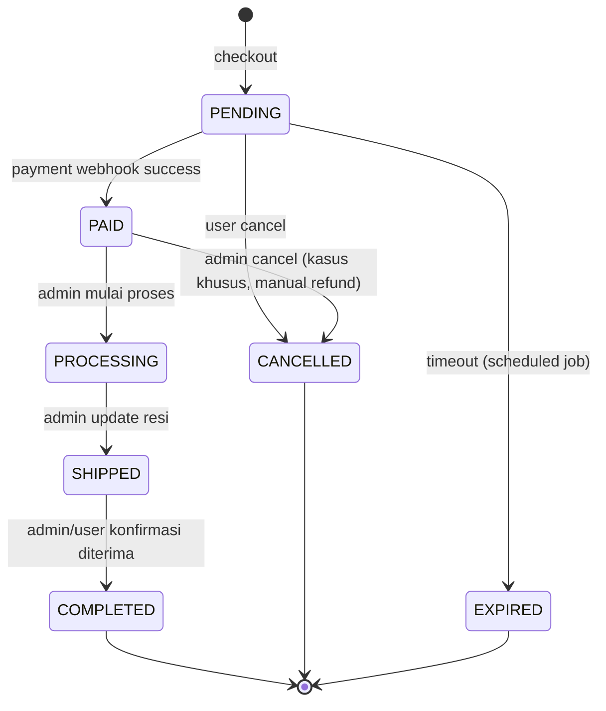
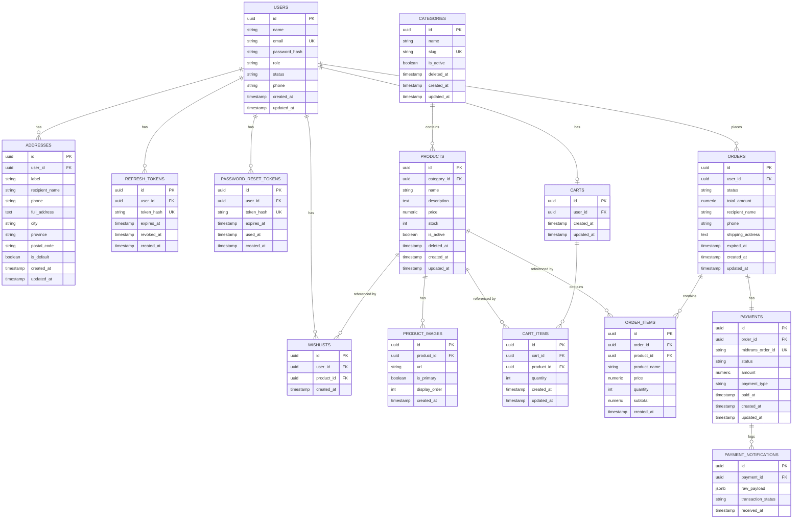
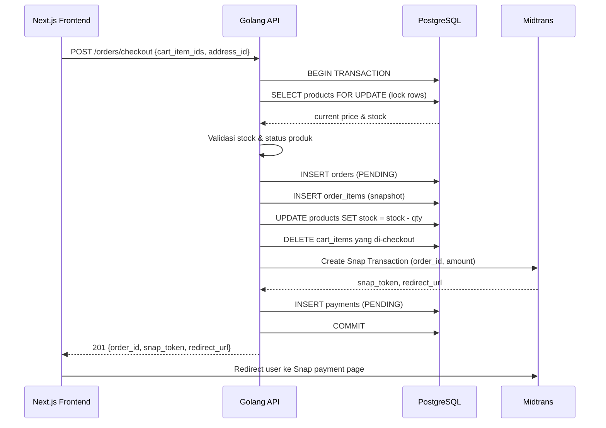
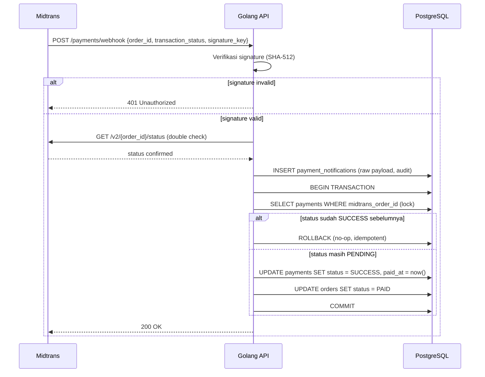
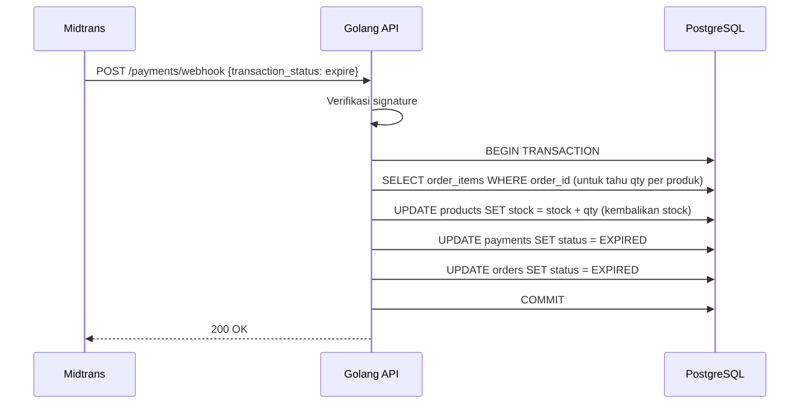
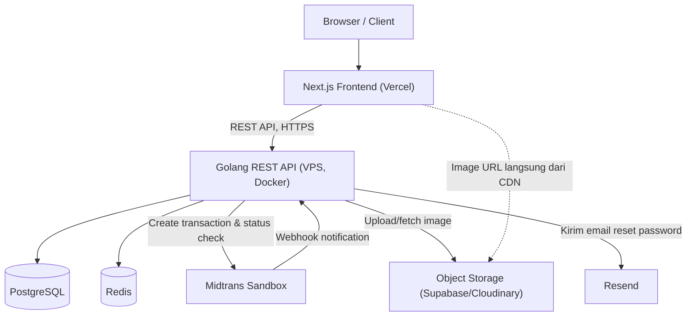

# Product Requirements Document — Mini E-Commerce (Single Vendor)

**Versi:** 1.0
**Tipe project:** Portfolio project — fokus backend engineering
**Status:** Draft untuk implementasi

---

## Assumptions & Decisions

Beberapa requirement di brief bersifat terbuka atau berpotensi konflik. Berikut keputusan yang diambil beserta alasannya, agar tidak ada ambiguitas saat development.

| # | Isu | Keputusan | Alasan |
|---|-----|-----------|--------|
| 1 | Auth token strategy | Access token JWT (short-lived, 15 menit) disimpan di memory (frontend state), refresh token (long-lived, 7 hari) disimpan di **httpOnly secure cookie** | Menghindari XSS mencuri access token dari localStorage, sekaligus tetap stateless untuk access token |
| 2 | Refresh token storage di backend | Disimpan sebagai hash di tabel `refresh_tokens`, bukan plaintext | Memungkinkan revocation per-device dan deteksi token reuse |
| 3 | Guest checkout | **Tidak didukung di MVP.** User wajib login sebelum checkout | Menyederhanakan model data (cart terikat ke user_id), fokus pada backend engineering bukan guest-session handling |
| 4 | Multiple payment method | Hanya Midtrans Snap (redirect) di MVP, bukan custom VA/QRIS terpisah | Midtrans Snap sudah mencakup banyak channel pembayaran dalam satu integrasi, cukup untuk tujuan pembelajaran webhook & payment gateway |
| 5 | Order cancellation | User hanya bisa cancel order dengan status `PENDING` (belum bayar). Setelah `PAID`, cancellation harus lewat admin (refund manual, di luar scope otomatis) | Menghindari kompleksitas automated refund melalui Midtrans yang di luar tujuan utama project |
| 6 | Stock reservation saat checkout | Stock dikurangi **saat order dibuat (PENDING)**, bukan saat payment berhasil, dengan expiry mechanism untuk melepas stock jika tidak dibayar dalam batas waktu | Mencegah overselling tanpa perlu reservation table terpisah; trade-off dijelaskan di bagian Stock & Concurrency |
| 7 | Payment expiry | Order `PENDING` yang tidak dibayar dalam 60 menit otomatis menjadi `EXPIRED` dan stock dikembalikan, dieksekusi oleh scheduled job | Konsisten dengan Midtrans Snap default expiry, dan mengajarkan konsep background job |
| 8 | Soft delete | Hanya diterapkan pada `products` dan `categories` | Order history dan cart harus tetap valid secara referensial meski product "dihapus" oleh admin; tabel lain (address, wishlist, cart) aman untuk hard delete karena tidak menjadi referensi historis |
| 9 | Multi-address per order | User dapat punya banyak address tapi setiap order menyimpan **snapshot address** (bukan foreign key ke address yang bisa berubah) | Sama seperti order_items snapshot, mencegah histori order berubah jika address di-edit setelahnya |
| 10 | Product variant (ukuran/warna) | **Tidak termasuk MVP.** Product bersifat single-SKU | Variant menambah kompleksitas signifikan pada cart/stock/order; didorong ke Phase 2 |
| 11 | Rating & review | Tidak termasuk MVP maupun Phase 2 awal, masuk Future | Tidak esensial untuk pembelajaran backend inti yang menjadi fokus project |
| 12 | CSRF protection | Karena access token dikirim via `Authorization: Bearer` header (bukan cookie) untuk request API utama, CSRF risk rendah. Namun refresh-token endpoint yang menggunakan cookie **diberi CSRF protection (double-submit token)** | Refresh endpoint adalah satu-satunya endpoint yang mengandalkan cookie ambient credential |
| 13 | Rate limiting implementation | Redis-based token bucket/fixed-window, bukan in-memory | Backend akan di-deploy sebagai container tunggal di MVP, tapi desain harus tetap scalable jika suatu saat di-scale horizontal |
| 14 | Transactional email (forgot password) | Menggunakan **Resend** sebagai email provider, dipanggil dari backend Golang via HTTP API | Resend punya free tier yang cukup untuk portfolio project, API sederhana (REST, tinggal HTTP POST), dan tidak perlu setup SMTP server sendiri |

---

## A. Product Overview

### Product Vision
Aplikasi e-commerce single-vendor yang memungkinkan satu toko online menjual produk langsung ke konsumen, dengan alur belanja standar industri: browsing produk, wishlist, cart, checkout, pembayaran online, dan tracking order — dibangun dengan praktik backend engineering yang production-grade.

### Problem Statement
Sebagai developer, portofolio berbasis CRUD sederhana tidak cukup menunjukkan kemampuan menangani masalah backend nyata: race condition pada stock, konsistensi data pada payment gateway, keamanan otorisasi, dan desain database yang tahan terhadap perubahan data di masa depan. Project ini dibuat untuk mendemonstrasikan penyelesaian masalah-masalah tersebut secara konkret.

### Goals
1. Membangun REST API Golang yang mengimplementasikan authentication & authorization yang aman (JWT + refresh token + RBAC).
2. Mendemonstrasikan penanganan concurrency (stock overselling) menggunakan PostgreSQL transaction & locking.
3. Mengintegrasikan payment gateway (Midtrans) dengan webhook sebagai source of truth, termasuk idempotency handling.
4. Menerapkan caching strategy (Redis) secara selektif dan beralasan.
5. Menghasilkan desain database yang production-oriented (snapshot data, soft delete yang tepat guna, indexing).
6. Deploy end-to-end (Vercel + VPS Docker) dengan observability dasar.

### Non-Goals
- Bukan marketplace multi-vendor.
- Bukan sistem dengan shipping/logistic integration kompleks (real-time ongkir, resi otomatis).
- Bukan sistem rekomendasi berbasis AI/ML.
- Bukan arsitektur microservices.
- Bukan sistem dengan skala traffic production enterprise sesungguhnya.

### Target Users
- **End user (pembeli):** individu yang ingin membeli produk secara online melalui web.
- **Admin (pemilik toko):** mengelola katalog produk dan memproses order.
- **Reviewer/recruiter:** target sekunder — mengevaluasi kualitas engineering project ini sebagai portofolio.

### Value Proposition
Sebuah aplikasi e-commerce fungsional penuh yang membuktikan kemampuan menangani transaksi finansial secara aman dan konsisten — bukan sekadar CRUD, melainkan sistem yang menghormati integritas data pada skenario konkuren dan pembayaran nyata (sandbox).

### Success Metrics
Karena ini adalah portfolio project (bukan produk dengan pengguna nyata), metrik keberhasilan bersifat engineering-oriented, bukan business-oriented:

| Metric | Target |
|---|---|
| End-to-end checkout flow (cart → payment → order PAID) berhasil tanpa manual intervention | 100% pada skenario uji |
| Concurrency test: 2 request checkout stock=1 secara paralel | Hanya 1 yang berhasil, tidak ada overselling |
| Webhook duplicate delivery | Order status tidak berubah dua kali / tidak terjadi efek ganda |
| Test coverage backend (unit + integration) pada domain kritis (checkout, payment, stock) | ≥ 70% |
| API response time (local/staging, bukan SLA produksi) | P95 < 300ms untuk endpoint non-payment |

---

## B. User Roles & Permissions

Tiga role: **Guest** (belum login), **User** (role: `user`), **Admin** (role: `admin`). Role disimpan sebagai kolom `role` di tabel `users` (bukan tabel `roles` terpisah, lihat Assumptions bagian database).

### Permission Matrix

| Resource / Action | Guest | User | Admin |
|---|---|---|---|
| Register / Login | ✅ | ✅ (logout only) | ✅ |
| Forgot/Reset password | ✅ | ✅ | ✅ |
| Lihat produk & detail | ✅ | ✅ | ✅ |
| Search/filter/sort produk | ✅ | ✅ | ✅ |
| Lihat kategori | ✅ | ✅ | ✅ |
| Kelola profil sendiri | ❌ | ✅ | ✅ |
| Wishlist | ❌ | ✅ (milik sendiri) | ❌ (bukan use case admin) |
| Cart | ❌ | ✅ (milik sendiri) | ❌ |
| Kelola address | ❌ | ✅ (milik sendiri) | ❌ |
| Checkout & payment | ❌ | ✅ | ❌ |
| Lihat order history | ❌ | ✅ (milik sendiri) | ✅ (semua order) |
| Cancel order | ❌ | ✅ (kondisi tertentu, milik sendiri) | ✅ (semua order) |
| Create/Update/Delete produk | ❌ | ❌ | ✅ |
| Kelola stock produk | ❌ | ❌ | ✅ |
| Upload/hapus product image | ❌ | ❌ | ✅ |
| CRUD kategori | ❌ | ❌ | ✅ |
| Kelola user (lihat/nonaktifkan) | ❌ | ❌ | ✅ |
| Ubah status order | ❌ | ❌ | ✅ |
| Lihat dashboard admin | ❌ | ❌ | ✅ |

Otorisasi diimplementasikan di backend melalui middleware `RequireAuth()` (memvalidasi JWT) dan `RequireRole("admin")`, dijalankan setelah `RequireAuth()`. Ownership check (misal: user hanya bisa melihat order miliknya) dilakukan di service layer dengan membandingkan `user_id` dari JWT claims terhadap `user_id` pada resource.

---

## C. Functional Requirements

### C.1 Authentication

**Register**
- Input: `name`, `email`, `password`, `confirm_password`.
- Validasi: email format & uniqueness, password minimal 8 karakter dengan kombinasi huruf & angka.
- Password di-hash menggunakan **bcrypt (cost factor 12)** sebelum disimpan.
- Setelah register, user dibuat dengan status `active` dan role `user`. (Verifikasi email tidak wajib di MVP — lihat Phase 2.)

**Login**
- Input: `email`, `password`.
- Backend memverifikasi password dengan bcrypt compare.
- Jika valid: generate access token (JWT, exp 15 menit) dan refresh token (random 256-bit string, exp 7 hari, disimpan hash di DB).
- Refresh token dikirim sebagai httpOnly, secure, SameSite=Strict cookie. Access token dikirim di response body.
- Failed login attempt dicatat untuk brute-force protection (lihat Security).

**Logout**
- Menghapus/merevoke refresh token di database (set `revoked_at`) dan menghapus cookie.

**Access Token**
- JWT berisi claims: `user_id`, `role`, `exp`, `iat`, `jti`.
- Signing menggunakan HMAC-SHA256 dengan secret dari environment variable.
- Divalidasi pada setiap request terproteksi melalui middleware.

**Refresh Token**
- Endpoint `POST /auth/refresh` membaca refresh token dari cookie, mencocokkan hash-nya di DB, memastikan belum revoked/expired.
- Menggunakan **rotation**: setiap refresh berhasil, token lama direvoke dan token baru diterbitkan (mencegah replay attack).
- Jika refresh token yang sudah revoked dipakai lagi (indikasi token dicuri), seluruh sesi user tersebut direvoke sebagai mitigasi.

**Forgot Password**
- User submit email → backend generate reset token (random, expiry 30 menit), simpan **hash**-nya di tabel `password_reset_tokens`.
- Email reset dikirim menggunakan **Resend** (transactional email API) — backend memanggil Resend API dengan template email berisi link reset (`{FRONTEND_URL}/reset-password?token=...`).
- Pengiriman email dilakukan **asynchronous** (fire-and-forget via goroutine, atau lebih baik lewat queue sederhana jika volume tinggi) agar endpoint `/auth/forgot-password` tidak menunggu response Resend API sebelum reply ke client — mencegah endpoint terasa lambat dan mengurangi timing-based user enumeration.
- Jika pengiriman ke Resend gagal (API down/rate limit), kegagalan **dicatat di log** tapi tidak mengubah response ke user (tetap generic success message) — reset token tetap valid tersimpan di DB sehingga bisa di-retry manual jika perlu.
- Tidak boleh mengonfirmasi apakah email terdaftar atau tidak (response sama untuk kedua kasus) — mencegah user enumeration.

**Reset Password**
- User submit token + password baru. Backend validasi token belum expired/used, lalu update password (hash baru) dan invalidate token serta **seluruh refresh token aktif** milik user (force re-login di semua device).

**Session/Token Security**
- Access token tidak pernah disimpan di localStorage (mitigasi XSS).
- Refresh token rotation + reuse detection.
- Semua token dicatat dengan `jti`/id agar dapat direvoke individual (misal saat logout dari device tertentu — Phase 2 feature: "manage active sessions").

### C.2 User

- **Profile:** lihat & update `name`, `phone`. Email tidak bisa diubah di MVP (menghindari kompleksitas re-verifikasi).
- **Address management:** CRUD address, tandai satu sebagai default.
- **Account status:** `active` / `inactive`. Admin dapat menonaktifkan user (`inactive` → tidak bisa login). Field ini juga menjadi tempat ekstensi untuk email verification di masa depan.

### C.3 Product

**Admin:**
- Create/Read/Update/Delete produk (`name`, `description`, `price`, `stock`, `category_id`, `is_active`).
- Delete bersifat **soft delete** (lihat Database Design).
- Activate/deactivate: mengubah `is_active`, produk inactive tidak muncul di listing publik dan tidak bisa di-checkout.
- Stock management: update manual stock (misal restock), dicatat di log/audit sederhana (opsional Phase 2: stock movement history).
- Product image: upload (ke object storage), hapus image; `is_primary` otomatis (gambar pertama = primary, saat primary dihapus gambar berikutnya dipromote); reorder manual tidak termasuk MVP.

**User:**
- Listing produk dengan pagination (`page`, `limit`, default limit 12, max 50).
- Detail produk (termasuk semua image, kategori, stock status).
- Search: berdasarkan `name`/`description` (PostgreSQL `ILIKE` atau full-text search — lihat catatan di bawah).
- Filter: berdasarkan `category_id`, rentang harga (`min_price`, `max_price`), ketersediaan stock.
- Sort: berdasarkan harga (asc/desc), terbaru (`created_at desc`), nama (A-Z).

> **Catatan search:** Untuk MVP, cukup gunakan `ILIKE '%query%'` dengan index `pg_trgm` untuk performa. PostgreSQL full-text search (`tsvector`) didorong ke Phase 2 karena menambah kompleksitas migrasi index tanpa nilai belajar yang signifikan berbeda pada skala portfolio project.

### C.4 Category

- **Admin:** CRUD kategori (`name`, `slug`). Kategori tidak boleh dihapus jika masih memiliki produk aktif (validasi di service layer) — atau, jika dihapus, produk terkait di-set `category_id = NULL` (soft delete kategori, produk tetap ada). Keputusan: **kategori memakai soft delete**, produk yang terasosiasi tetap tampil namun kategori tidak muncul di listing kategori aktif.
- **User:** browse daftar kategori aktif, filter produk berdasarkan kategori.

### C.5 Wishlist

- Add: user menambahkan produk ke wishlist. Constraint unique (`user_id`, `product_id`) mencegah duplikat — return 409 jika sudah ada.
- Remove: hapus item dari wishlist.
- List: tampilkan semua wishlist milik user, termasuk status produk saat ini (in stock/out of stock/inactive) agar UI dapat menampilkan indikator.
- Produk yang sudah di-soft-delete tetap ditampilkan sebagai "tidak tersedia" atau otomatis di-exclude (keputusan: **di-exclude dari list**, karena wishlist bukan data historis yang wajib dipertahankan).

### C.6 Cart

- Add product: jika produk sudah ada di cart, quantity ditambahkan (bukan membuat item baru) — constraint unique (`cart_id`, `product_id`).
- Update quantity: validasi terhadap stock tersedia saat request (soft validation; validasi keras tetap dilakukan ulang saat checkout).
- Remove item / clear cart.
- Validate stock: dilakukan di endpoint cart (untuk UX, menampilkan warning) **dan** wajib diulang saat checkout (source of truth).
- Calculate subtotal: dihitung on-the-fly dari harga produk saat ini (real-time), bukan disimpan statis di cart_items — karena cart bukan data historis.
- Handle inactive/deleted product di cart: endpoint `GET /cart` mengembalikan flag `is_available: false` per item, item tersebut di-skip otomatis dari total & tidak bisa di-checkout sampai user menghapusnya.

### C.7 Address

- CRUD address per user (`label`, `recipient_name`, `phone`, `full_address`, `city`, `province`, `postal_code`).
- Default address: hanya satu address boleh `is_default = true` per user (di-enforce via service layer: set default baru → unset default lama dalam satu transaction).
- Validasi: semua field wajib diisi kecuali `label` (opsional), `postal_code` divalidasi format numerik.

### C.8 Checkout

Flow detail:

1. User memilih item cart mana yang ingin di-checkout (bisa checkout sebagian cart — kirim array `cart_item_ids`).
2. Backend memulai **database transaction**.
3. Validasi setiap produk: masih ada (belum soft-deleted), `is_active = true`.
4. Validasi stock: `stock >= quantity` yang diminta, dengan **row lock** (`SELECT ... FOR UPDATE`) pada baris produk untuk mencegah race condition (detail di bagian Stock & Concurrency).
5. Harga diambil ulang dari tabel `products` di database saat itu juga — **harga dari request body/frontend diabaikan sepenuhnya**.
6. Backend membuat record `orders` dengan status `PENDING`, `total_amount` dihitung dari harga database, dan snapshot `address` (recipient_name, phone, full_address, dll disalin langsung ke kolom di tabel `orders`, bukan foreign key).
7. Backend membuat `order_items` untuk setiap produk, menyimpan snapshot `product_name`, `price`, `quantity`, `subtotal`.
8. Stock produk dikurangi dalam transaction yang sama.
9. Item yang berhasil di-checkout dihapus dari cart.
10. Backend memanggil Midtrans API (create transaction), menyimpan record `payments` dengan `midtrans_order_id`, `status = PENDING`.
11. Transaction di-commit **hanya setelah** seluruh langkah database berhasil. Jika request ke Midtrans gagal, seluruh transaction (termasuk pengurangan stock) di-rollback.
12. Response ke frontend: `order_id`, `payment_url` / `snap_token` dari Midtrans.

**Mencegah manipulasi dari frontend:**

| Data | Bagaimana dicegah |
|---|---|
| Harga (price) | Tidak pernah diterima dari request. Selalu di-`SELECT` ulang dari tabel `products` di dalam transaction checkout. |
| Quantity | Diterima dari request, tapi divalidasi ulang terhadap stock aktual di database (dengan lock) sebelum diproses. |
| Total amount | Selalu dihitung ulang di backend (`SUM(price * quantity)`), tidak pernah menerima `total` dari frontend. |
| Product ID | Divalidasi keberadaannya (`is_active`, belum di-soft-delete) sebelum diproses; product ID yang tidak valid/tidak ditemukan → checkout ditolak dengan error jelas menyebutkan item mana yang bermasalah. |

Prinsip inti: **request body dari frontend hanya berisi referensi (ID + quantity yang diinginkan), tidak pernah nilai finansial**. Semua nilai finansial adalah hasil query/kalkulasi backend.

### C.9 Order

**Status:** `PENDING`, `PAID`, `PROCESSING`, `SHIPPED`, `COMPLETED`, `CANCELLED`, `EXPIRED`.

**State transition:**



**Kondisi transisi:**

| Transisi | Trigger | Siapa |
|---|---|---|
| PENDING → PAID | Webhook Midtrans `settlement`/`capture` sukses | Sistem (webhook handler) |
| PENDING → EXPIRED | Melewati batas waktu (60 menit) tanpa pembayaran | Sistem (scheduled job) |
| PENDING → CANCELLED | User membatalkan sebelum bayar | User |
| PAID → PROCESSING | Admin mulai memproses pesanan | Admin |
| PROCESSING → SHIPPED | Admin input info pengiriman | Admin |
| SHIPPED → COMPLETED | Konfirmasi penerimaan (auto setelah N hari, atau manual) | User / Sistem |
| PAID → CANCELLED | Kasus khusus (stok ternyata bermasalah, dsb) | Admin only |

Order yang sudah `COMPLETED`, `CANCELLED`, atau `EXPIRED` bersifat final — tidak ada transisi keluar.

### C.10 Payment

- **Create payment transaction:** dilakukan sebagai bagian dari checkout flow (langkah 10 di atas), memanggil Midtrans Snap API, menyimpan `payments` record dengan status `PENDING`.
- **Payment status:** `PENDING`, `SUCCESS`, `FAILED`, `EXPIRED`, `CANCELLED` — disinkronkan dari notification Midtrans.
- **Midtrans notification/webhook:** endpoint `POST /payments/webhook` menerima notifikasi dari Midtrans berisi `order_id`, `transaction_status`, `signature_key`, dll.
- **Payment verification:** signature divalidasi (SHA-512 dari `order_id + status_code + gross_amount + server_key`) untuk memastikan notifikasi benar-benar dari Midtrans. Selain itu, backend melakukan **server-to-server status check** ke Midtrans API (`GET /v2/{order_id}/status`) sebagai double-check sebelum mengubah status order — tidak sepenuhnya mempercayai payload webhook mentah.
- **Idempotency:** webhook handler mengecek apakah `payments.status` sudah sesuai dengan status yang dikirim sebelum melakukan update. Jika sudah sama (`SUCCESS` → `SUCCESS`), request diabaikan tapi tetap return `200 OK` (agar Midtrans tidak retry terus). Digunakan juga tabel log `payment_notifications` untuk menyimpan setiap payload webhook yang masuk (audit trail dan deteksi duplikat berdasarkan `transaction_id` + `transaction_status`).
- **Handling duplicate webhook:** karena update bersifat idempotent (set status berdasarkan nilai final, bukan increment/toggle), webhook duplikat aman diproses berkali-kali tanpa efek ganda.
- **Failed payment:** status Midtrans `deny`/`failure` → `payments.status = FAILED`, order tetap `PENDING` (user bisa retry payment dalam window waktu yang tersisa, jika didukung Snap) atau order langsung `EXPIRED` tergantung kebijakan Snap.
- **Expired payment:** status Midtrans `expire` → `payments.status = EXPIRED`, `orders.status = EXPIRED`, stock dikembalikan dalam transaction yang sama.
- **Cancelled payment:** status Midtrans `cancel` → sama seperti expired, stock dikembalikan.

**PENTING — ditegaskan ulang:** Frontend menerima redirect dari Midtrans (`finish_redirect_url`) **hanya untuk keperluan UX** (menampilkan halaman "terima kasih"). Redirect ini **tidak pernah** digunakan untuk mengubah status order. Satu-satunya jalur yang boleh mengubah status order menjadi `PAID` adalah webhook handler setelah verifikasi signature + server-to-server status check berhasil.

### C.11 Admin Dashboard

Metrics minimal:
- Total users (aktif).
- Total products (aktif).
- Total orders (breakdown per status).
- Revenue (total `total_amount` dari order berstatus `PAID` ke atas, dalam periode filter).
- Pending orders (jumlah order `PENDING` — perlu perhatian jika terlalu banyak/lama).
- Low stock products (produk dengan `stock <= threshold`, misal 5).

Filter periode: `today`, `7d`, `30d`, `custom range` (query param `start_date`, `end_date`). Query dashboard menggunakan aggregate query dengan index pada `created_at` dan `status`.

---

## D. Database Design

### D.1 ERD



### D.2 Detail Tabel

#### `users`
| Column | Type | Constraint | Default | Keterangan |
|---|---|---|---|---|
| id | UUID | PK | `gen_random_uuid()` | |
| name | VARCHAR(100) | NOT NULL | — | |
| email | VARCHAR(255) | NOT NULL, UNIQUE | — | index unique otomatis |
| password_hash | VARCHAR(255) | NOT NULL | — | bcrypt hash |
| role | VARCHAR(20) | NOT NULL | `'user'` | `'user'` \| `'admin'` |
| status | VARCHAR(20) | NOT NULL | `'active'` | `'active'` \| `'inactive'` |
| phone | VARCHAR(20) | NULLABLE | NULL | |
| created_at | TIMESTAMPTZ | NOT NULL | `now()` | |
| updated_at | TIMESTAMPTZ | NOT NULL | `now()` | |

*Tidak soft delete* — user tidak pernah dihapus, cukup dinonaktifkan via `status`, karena user adalah referensi historis penting (order, dsb).

Index: `UNIQUE(email)`, `INDEX(role)`.

#### `categories`
| Column | Type | Constraint | Default |
|---|---|---|---|
| id | UUID | PK | `gen_random_uuid()` |
| name | VARCHAR(100) | NOT NULL | — |
| slug | VARCHAR(120) | NOT NULL, UNIQUE | — |
| is_active | BOOLEAN | NOT NULL | `true` |
| deleted_at | TIMESTAMPTZ | NULLABLE | NULL |
| created_at | TIMESTAMPTZ | NOT NULL | `now()` |
| updated_at | TIMESTAMPTZ | NOT NULL | `now()` |

*Soft delete: YA.* Alasan: produk lama mungkin masih mereferensikan kategori ini pada order historis (melalui produk), sehingga tidak boleh benar-benar hilang dari DB.

Index: `UNIQUE(slug)`, partial index `WHERE deleted_at IS NULL AND is_active = true`.

#### `products`
| Column | Type | Constraint | Default |
|---|---|---|---|
| id | UUID | PK | `gen_random_uuid()` |
| category_id | UUID | FK → categories(id), NULLABLE | NULL |
| name | VARCHAR(200) | NOT NULL | — |
| description | TEXT | NULLABLE | NULL |
| price | NUMERIC(12,2) | NOT NULL, CHECK (price >= 0) | — |
| stock | INT | NOT NULL, CHECK (stock >= 0) | `0` |
| is_active | BOOLEAN | NOT NULL | `true` |
| deleted_at | TIMESTAMPTZ | NULLABLE | NULL |
| created_at | TIMESTAMPTZ | NOT NULL | `now()` |
| updated_at | TIMESTAMPTZ | NOT NULL | `now()` |

*Soft delete: YA.* Alasan eksplisit: `order_items` menyimpan snapshot, **tapi** relasi FK `product_id` di `order_items`, `cart_items`, `wishlists` tetap mengarah ke `products.id`. Jika produk di-hard-delete, FK tersebut akan patah atau memaksa `ON DELETE CASCADE`/`SET NULL` yang merusak histori. Soft delete menjaga integritas referensial sekaligus histori tetap utuh.

Index: `INDEX(category_id)`, `INDEX(is_active, deleted_at)`, `GIN` trigram index pada `name` untuk search (`pg_trgm`).

#### `product_images`
| Column | Type | Constraint | Default |
|---|---|---|---|
| id | UUID | PK | `gen_random_uuid()` |
| product_id | UUID | FK → products(id) ON DELETE CASCADE, NOT NULL | — |
| url | VARCHAR(500) | NOT NULL | — |
| is_primary | BOOLEAN | NOT NULL | `false` |
| display_order | INT | NOT NULL | `0` |
| created_at | TIMESTAMPTZ | NOT NULL | `now()` |

Tidak soft delete (child dari product, ikut soft-deleted secara logis via parent).
Index: `INDEX(product_id)`.

#### `wishlists`
| Column | Type | Constraint | Default |
|---|---|---|---|
| id | UUID | PK | `gen_random_uuid()` |
| user_id | UUID | FK → users(id) ON DELETE CASCADE, NOT NULL | — |
| product_id | UUID | FK → products(id) ON DELETE CASCADE, NOT NULL | — |
| created_at | TIMESTAMPTZ | NOT NULL | `now()` |

Constraint: `UNIQUE(user_id, product_id)` — mencegah duplikat.
Index: `INDEX(user_id)`.

#### `carts`
| Column | Type | Constraint | Default |
|---|---|---|---|
| id | UUID | PK | `gen_random_uuid()` |
| user_id | UUID | FK → users(id) ON DELETE CASCADE, NOT NULL, UNIQUE | — |
| created_at | TIMESTAMPTZ | NOT NULL | `now()` |
| updated_at | TIMESTAMPTZ | NOT NULL | `now()` |

Satu user = satu cart aktif (`UNIQUE(user_id)`), dibuat otomatis saat pertama kali add-to-cart (lazy creation).

#### `cart_items`
| Column | Type | Constraint | Default |
|---|---|---|---|
| id | UUID | PK | `gen_random_uuid()` |
| cart_id | UUID | FK → carts(id) ON DELETE CASCADE, NOT NULL | — |
| product_id | UUID | FK → products(id), NOT NULL | — |
| quantity | INT | NOT NULL, CHECK (quantity > 0) | — |
| created_at | TIMESTAMPTZ | NOT NULL | `now()` |
| updated_at | TIMESTAMPTZ | NOT NULL | `now()` |

Constraint: `UNIQUE(cart_id, product_id)`.
Index: `INDEX(cart_id)`.

#### `addresses`
| Column | Type | Constraint | Default |
|---|---|---|---|
| id | UUID | PK | `gen_random_uuid()` |
| user_id | UUID | FK → users(id) ON DELETE CASCADE, NOT NULL | — |
| label | VARCHAR(50) | NULLABLE | NULL |
| recipient_name | VARCHAR(100) | NOT NULL | — |
| phone | VARCHAR(20) | NOT NULL | — |
| full_address | TEXT | NOT NULL | — |
| city | VARCHAR(100) | NOT NULL | — |
| province | VARCHAR(100) | NOT NULL | — |
| postal_code | VARCHAR(10) | NOT NULL | — |
| is_default | BOOLEAN | NOT NULL | `false` |
| created_at | TIMESTAMPTZ | NOT NULL | `now()` |
| updated_at | TIMESTAMPTZ | NOT NULL | `now()` |

Index: `INDEX(user_id)`. Enforcement "hanya satu default" dilakukan di service layer dalam transaction (bukan di level DB constraint karena partial unique index pada boolean bisa dipakai tapi lebih rumit; keputusan: logic di aplikasi cukup untuk skala ini).

#### `orders`
| Column | Type | Constraint | Default |
|---|---|---|---|
| id | UUID | PK | `gen_random_uuid()` |
| user_id | UUID | FK → users(id), NOT NULL | — |
| status | VARCHAR(20) | NOT NULL | `'PENDING'` |
| total_amount | NUMERIC(12,2) | NOT NULL, CHECK (total_amount >= 0) | — |
| recipient_name | VARCHAR(100) | NOT NULL | — |
| phone | VARCHAR(20) | NOT NULL | — |
| shipping_address | TEXT | NOT NULL | — |
| expired_at | TIMESTAMPTZ | NULLABLE | — |
| created_at | TIMESTAMPTZ | NOT NULL | `now()` |
| updated_at | TIMESTAMPTZ | NOT NULL | `now()` |

Tidak soft delete — order adalah data transaksional yang tidak pernah dihapus.
Index: `INDEX(user_id, created_at DESC)`, `INDEX(status)`.

#### `order_items`
| Column | Type | Constraint | Default |
|---|---|---|---|
| id | UUID | PK | `gen_random_uuid()` |
| order_id | UUID | FK → orders(id) ON DELETE CASCADE, NOT NULL | — |
| product_id | UUID | FK → products(id), NOT NULL | — |
| product_name | VARCHAR(200) | NOT NULL | — snapshot |
| price | NUMERIC(12,2) | NOT NULL | — snapshot |
| quantity | INT | NOT NULL, CHECK (quantity > 0) | — |
| subtotal | NUMERIC(12,2) | NOT NULL | — `price * quantity` |
| created_at | TIMESTAMPTZ | NOT NULL | `now()` |

**Alasan snapshot:** jika admin mengubah harga atau nama produk setelah order dibuat, histori order pelanggan tidak boleh ikut berubah — pelanggan harus tetap melihat harga yang mereka bayar saat itu. `product_id` tetap disimpan untuk keperluan analitik/link ke produk saat ini, tapi field finansial & nama **tidak pernah** di-join secara live dari tabel `products`.

Index: `INDEX(order_id)`.

#### `payments`
| Column | Type | Constraint | Default |
|---|---|---|---|
| id | UUID | PK | `gen_random_uuid()` |
| order_id | UUID | FK → orders(id), NOT NULL, UNIQUE | — |
| midtrans_order_id | VARCHAR(100) | NOT NULL, UNIQUE | — |
| status | VARCHAR(20) | NOT NULL | `'PENDING'` |
| amount | NUMERIC(12,2) | NOT NULL | — |
| payment_type | VARCHAR(50) | NULLABLE | NULL |
| paid_at | TIMESTAMPTZ | NULLABLE | NULL |
| created_at | TIMESTAMPTZ | NOT NULL | `now()` |
| updated_at | TIMESTAMPTZ | NOT NULL | `now()` |

Index: `UNIQUE(order_id)`, `UNIQUE(midtrans_order_id)`.

#### `payment_notifications` (audit log webhook)
| Column | Type | Constraint | Default |
|---|---|---|---|
| id | UUID | PK | `gen_random_uuid()` |
| payment_id | UUID | FK → payments(id), NOT NULL | — |
| raw_payload | JSONB | NOT NULL | — |
| transaction_status | VARCHAR(30) | NOT NULL | — |
| received_at | TIMESTAMPTZ | NOT NULL | `now()` |

Index: `INDEX(payment_id, received_at)`.

#### `refresh_tokens`
| Column | Type | Constraint | Default |
|---|---|---|---|
| id | UUID | PK | `gen_random_uuid()` |
| user_id | UUID | FK → users(id) ON DELETE CASCADE, NOT NULL | — |
| token_hash | VARCHAR(255) | NOT NULL, UNIQUE | — |
| expires_at | TIMESTAMPTZ | NOT NULL | — |
| revoked_at | TIMESTAMPTZ | NULLABLE | NULL |
| created_at | TIMESTAMPTZ | NOT NULL | `now()` |

Index: `INDEX(user_id)`, `UNIQUE(token_hash)`.

#### `password_reset_tokens`
| Column | Type | Constraint | Default |
|---|---|---|---|
| id | UUID | PK | `gen_random_uuid()` |
| user_id | UUID | FK → users(id) ON DELETE CASCADE, NOT NULL | — |
| token_hash | VARCHAR(255) | NOT NULL, UNIQUE | — |
| expires_at | TIMESTAMPTZ | NOT NULL | — |
| used_at | TIMESTAMPTZ | NULLABLE | NULL |
| created_at | TIMESTAMPTZ | NOT NULL | `now()` |

Index: `UNIQUE(token_hash)`.

---

## E. API Specification

Format response sukses standar:
```json
{
  "success": true,
  "data": { },
  "meta": { }
}
```
`meta` hanya muncul pada endpoint dengan pagination.

### /health

| Method | Endpoint | Auth | Deskripsi |
|---|---|---|---|
| GET | /health | Public | Liveness — proses hidup, selalu `200` |
| GET | /health/ready | Public | Readiness — ping koneksi DB & Redis |

**GET /health**
Response `200`:
```json
{
  "success": true,
  "data": { "status": "ok" }
}
```

**GET /health/ready**
Response `200` (semua dependency siap):
```json
{
  "success": true,
  "data": { "db": "up", "redis": "up" }
}
```
Response `503` (DB down — aplikasi tidak bisa melayani):
```json
{
  "success": false,
  "data": { "db": "down", "redis": "up" }
}
```
Response `200` (Redis down — opsional, aplikasi tetap melayani, warning di response):
```json
{
  "success": true,
  "data": { "db": "up", "redis": "down (optional, app still serving)" }
}
```

### /auth

| Method | Endpoint | Auth | Deskripsi |
|---|---|---|---|
| POST | /auth/register | Public | Registrasi user baru |
| POST | /auth/login | Public | Login, return access token + set refresh cookie |
| POST | /auth/logout | Required | Revoke refresh token |
| POST | /auth/refresh | Cookie (refresh token) | Rotate & issue access token baru |
| POST | /auth/forgot-password | Public | Kirim reset token |
| POST | /auth/reset-password | Public | Reset password dengan token |

**POST /auth/register**
Request:
```json
{
  "name": "Budi Santoso",
  "email": "budi@example.com",
  "password": "SecurePass123",
  "confirm_password": "SecurePass123"
}
```
Response `201`:
```json
{
  "success": true,
  "data": {
    "id": "b3f1...",
    "name": "Budi Santoso",
    "email": "budi@example.com",
    "role": "user"
  }
}
```
Errors: `400 VALIDATION_ERROR`, `409 EMAIL_ALREADY_EXISTS`.

**POST /auth/login**
Request:
```json
{ "email": "budi@example.com", "password": "SecurePass123" }
```
Response `200`:
```json
{
  "success": true,
  "data": {
    "access_token": "eyJhbGciOi...",
    "expires_in": 900,
    "user": { "id": "b3f1...", "name": "Budi Santoso", "role": "user" }
  }
}
```
(refresh token dikirim via `Set-Cookie`, httpOnly)
Errors: `401 INVALID_CREDENTIALS`, `403 ACCOUNT_INACTIVE`, `429 TOO_MANY_ATTEMPTS`.

### /users
| Method | Endpoint | Auth | Deskripsi |
|---|---|---|---|
| GET | /users/me | User/Admin | Profil sendiri |
| PATCH | /users/me | User/Admin | Update profil (name, phone) |
| GET | /admin/users | Admin | List semua user (pagination, filter status) |
| PATCH | /admin/users/:id/status | Admin | Aktif/nonaktifkan user |

### /products
| Method | Endpoint | Auth | Deskripsi |
|---|---|---|---|
| GET | /products | Public | List produk (pagination, search, filter, sort) |
| GET | /products/:id | Public | Detail produk |
| POST | /admin/products | Admin | Create produk |
| PUT | /admin/products/:id | Admin | Update produk |
| DELETE | /admin/products/:id | Admin | Soft delete produk |
| PATCH | /admin/products/:id/status | Admin | Toggle is_active |
| PATCH | /admin/products/:id/stock | Admin | Update stock |
| POST | /admin/products/:id/images | Admin | Upload image |
| DELETE | /admin/products/:id/images/:imageId | Admin | Hapus image |

**GET /products**
Query params: `page`, `limit`, `search`, `category_id`, `min_price`, `max_price`, `sort` (`price_asc`\|`price_desc`\|`newest`\|`name_asc`).

Response `200`:
```json
{
  "success": true,
  "data": [
    {
      "id": "p1...",
      "name": "Kaos Polos Katun",
      "price": 89000,
      "stock": 15,
      "is_active": true,
      "primary_image": "https://storage.example.com/p1/main.jpg",
      "category": { "id": "c1...", "name": "Pakaian" }
    }
  ],
  "meta": { "page": 1, "limit": 12, "total": 48, "total_pages": 4 }
}
```
Errors: `400 INVALID_QUERY_PARAM`.

**POST /admin/products**
Request:
```json
{
  "name": "Kaos Polos Katun",
  "description": "Kaos 100% katun combed 30s",
  "price": 89000,
  "stock": 50,
  "category_id": "c1..."
}
```
Response `201` (produk baru). Errors: `400 VALIDATION_ERROR`, `401 UNAUTHORIZED`, `403 FORBIDDEN`, `404 CATEGORY_NOT_FOUND`.

### /categories
| Method | Endpoint | Auth | Deskripsi |
|---|---|---|---|
| GET | /categories | Public | List kategori aktif |
| POST | /admin/categories | Admin | Create kategori |
| PUT | /admin/categories/:id | Admin | Update kategori |
| DELETE | /admin/categories/:id | Admin | Soft delete kategori |

### /wishlist
| Method | Endpoint | Auth | Deskripsi |
|---|---|---|---|
| GET | /wishlist | User | List wishlist |
| POST | /wishlist | User | Add produk ke wishlist |
| DELETE | /wishlist/:productId | User | Remove dari wishlist |

Errors POST: `409 PRODUCT_ALREADY_IN_WISHLIST`, `404 PRODUCT_NOT_FOUND`.

### /cart
| Method | Endpoint | Auth | Deskripsi |
|---|---|---|---|
| GET | /cart | User | Lihat cart + subtotal |
| POST | /cart/items | User | Add item |
| PATCH | /cart/items/:id | User | Update quantity |
| DELETE | /cart/items/:id | User | Remove item |
| DELETE | /cart | User | Clear cart |

**GET /cart** Response `200`:
```json
{
  "success": true,
  "data": {
    "items": [
      {
        "id": "ci1...",
        "product_id": "p1...",
        "name": "Kaos Polos Katun",
        "price": 89000,
        "quantity": 2,
        "subtotal": 178000,
        "is_available": true
      }
    ],
    "total": 178000
  }
}
```

### /addresses
| Method | Endpoint | Auth | Deskripsi |
|---|---|---|---|
| GET | /addresses | User | List address |
| POST | /addresses | User | Tambah address |
| PUT | /addresses/:id | User | Update address |
| DELETE | /addresses/:id | User | Hapus address |
| PATCH | /addresses/:id/default | User | Set sebagai default |

### /orders
| Method | Endpoint | Auth | Deskripsi |
|---|---|---|---|
| POST | /orders/checkout | User | Checkout (buat order + payment) |
| GET | /orders | User | Order history milik sendiri |
| GET | /orders/:id | User | Detail order (ownership check) |
| POST | /orders/:id/cancel | User | Cancel order (kondisi: status PENDING) |
| GET | /admin/orders | Admin | List semua order (filter status) |
| PATCH | /admin/orders/:id/status | Admin | Update status order |

**POST /orders/checkout**
Request:
```json
{
  "cart_item_ids": ["ci1...", "ci2..."],
  "address_id": "a1..."
}
```
Response `201`:
```json
{
  "success": true,
  "data": {
    "order_id": "o1...",
    "total_amount": 178000,
    "status": "PENDING",
    "payment": {
      "snap_token": "66e4fa55-...",
      "redirect_url": "https://app.sandbox.midtrans.com/snap/v3/redirection/66e4fa55-..."
    }
  }
}
```
Errors: `400 CART_EMPTY`, `400 INVALID_ADDRESS`, `409 PRODUCT_OUT_OF_STOCK` (menyebutkan produk mana), `409 PRODUCT_INACTIVE`, `502 PAYMENT_GATEWAY_ERROR`.

**POST /orders/:id/cancel**
Response `409 ORDER_CANNOT_BE_CANCELLED` jika status bukan `PENDING`.

### /payments
| Method | Endpoint | Auth | Deskripsi |
|---|---|---|---|
| POST | /payments/webhook | Midtrans (signature-verified) | Terima notifikasi status pembayaran |
| GET | /orders/:id/payment | User | Lihat status payment untuk order tertentu |

### /admin
| Method | Endpoint | Auth | Deskripsi |
|---|---|---|---|
| GET | /admin/dashboard | Admin | Ringkasan metrics (dengan `period` query param) |

---

## F. Payment Flow (Sequence Diagrams)

### F.1 Checkout & Create Payment



### F.2 Webhook Success



### F.3 Webhook Failed / Expired / Cancelled



**Duplicate webhook:** setiap notifikasi dicatat di `payment_notifications` sebagai audit trail. Update status order/payment menggunakan pola "set to final state" (bukan increment), sehingga menerima webhook yang sama dua kali tidak menghasilkan efek ganda (stock tidak dikembalikan dua kali, dsb) — dijaga dengan mengecek status saat ini sebelum melakukan mutasi, di dalam transaction dengan row lock pada `payments`.

**Konsistensi order & payment:** kedua tabel selalu diupdate dalam **satu database transaction** yang sama, tidak pernah terpisah — mencegah kondisi `payments.status = SUCCESS` tapi `orders.status` masih `PENDING` (atau sebaliknya).

---

## G. Stock & Concurrency

### Skenario
Stock produk = 1. User A dan User B checkout quantity = 1 secara hampir bersamaan.

### Strategi: Pessimistic Locking dengan `SELECT ... FOR UPDATE`

```sql
BEGIN;

SELECT id, stock, price, is_active
FROM products
WHERE id = $1
FOR UPDATE;

-- Golang: cek di application code
-- if stock < requested_quantity -> ROLLBACK, return error

UPDATE products
SET stock = stock - $2
WHERE id = $1;

INSERT INTO orders (...) VALUES (...);
INSERT INTO order_items (...) VALUES (...);

COMMIT;
```

**Cara kerja:** `FOR UPDATE` mengunci baris produk yang dipilih. Jika User A dan User B checkout produk yang sama secara bersamaan:
1. Transaction A mendapat row lock terlebih dahulu (misal lebih cepat 1ms).
2. Transaction B akan **blocked** menunggu di statement `SELECT ... FOR UPDATE` sampai Transaction A selesai (`COMMIT` atau `ROLLBACK`).
3. Setelah Transaction A commit (stock jadi 0), Transaction B melanjutkan `SELECT`, membaca stock = 0, validasi gagal, transaction di-rollback, user B menerima error `PRODUCT_OUT_OF_STOCK`.

Ini mencegah kedua transaction membaca stock = 1 secara bersamaan (yang akan menyebabkan keduanya lolos validasi dan stock menjadi -1).

### Mengapa bukan Optimistic Locking?
Optimistic locking (menggunakan kolom `version`, retry saat conflict) juga valid, namun untuk kasus checkout (write yang harus segera sukses/gagal, bukan long-running edit), pessimistic locking lebih sesuai karena:
- Checkout adalah operasi singkat (< 100ms), sehingga lock tidak menahan lama.
- Menghindari kompleksitas retry logic di application layer.
- Lebih mudah dijelaskan & diuji untuk tujuan pembelajaran.

*Optimistic locking tetap disebutkan sebagai alternatif yang valid untuk kasus dengan write contention tinggi pada baris yang sama dalam skala besar — di luar scope MVP ini.*

### Implementasi Golang (ringkas)
```go
func (r *ProductRepo) CheckoutWithLock(ctx context.Context, tx pgx.Tx, productID string, qty int) error {
    var stock int
    var isActive bool

    err := tx.QueryRow(ctx,
        `SELECT stock, is_active FROM products WHERE id = $1 FOR UPDATE`,
        productID,
    ).Scan(&stock, &isActive)
    if err != nil {
        return err
    }

    if !isActive {
        return ErrProductInactive
    }
    if stock < qty {
        return ErrInsufficientStock
    }

    _, err = tx.Exec(ctx,
        `UPDATE products SET stock = stock - $1 WHERE id = $2`,
        qty, productID,
    )
    return err
}
```

Seluruh checkout flow dibungkus dalam satu `pgx.Tx`, dengan isolation level default `READ COMMITTED` (cukup untuk kasus ini karena `FOR UPDATE` sudah menyediakan locking eksplisit yang dibutuhkan — `SERIALIZABLE` tidak diperlukan dan akan menambah kemungkinan serialization failure yang tidak perlu ditangani).

**Deadlock avoidance:** jika checkout melibatkan multiple produk, kunci baris produk **selalu dalam urutan yang konsisten** (misal `ORDER BY product_id ASC` sebelum lock) untuk mencegah deadlock antara dua transaction yang mengunci produk yang sama dalam urutan berbeda.

---

## H. Redis

Redis digunakan **secara selektif**, hanya di tempat yang memberikan manfaat nyata:

### H.1 Product Listing Cache
- **Problem:** Endpoint `GET /products` (dengan filter/sort) di-hit berulang oleh banyak visitor, query melibatkan join + pagination yang relatif costly.
- **Key format:** `products:list:{hash_of_query_params}` (hash dari kombinasi page, limit, search, category, sort).
- **TTL:** 5 menit.
- **Invalidation:** saat admin create/update/delete produk atau ubah stock → **invalidate seluruh key dengan prefix `products:list:*`** (menggunakan Redis `SCAN` + `DEL`, bukan `KEYS` untuk menghindari blocking). Trade-off: cache invalidation kasar (semua list cache dihapus) dipilih karena lebih sederhana & aman dibanding mencoba invalidate granular per-filter.
- **Fallback saat Redis down:** query langsung ke PostgreSQL (cache-aside pattern, Redis bersifat optional enhancement, bukan dependency keras).

### H.2 Product Detail Cache
- **Problem:** Detail produk sering diakses (dari listing, wishlist, cart), data relatif jarang berubah.
- **Key format:** `product:detail:{product_id}`.
- **TTL:** 10 menit.
- **Invalidation:** saat produk terkait di-update/delete/stock berubah → `DEL product:detail:{id}` langsung (targeted, karena key spesifik per produk).
- **Fallback:** query DB langsung.

### H.3 Rate Limiting
- **Problem:** mencegah brute-force login dan abuse pada endpoint publik.
- **Implementasi:** fixed-window counter per IP+endpoint.
- **Key format:** `ratelimit:{endpoint}:{ip}` misal `ratelimit:login:103.10.x.x`.
- **TTL:** window size (misal 60 detik untuk general endpoint, 15 menit khusus login).
- **Invalidation:** otomatis via TTL expiry, tidak perlu manual.
- **Fallback saat Redis down:** **fail-open dengan log warning** untuk endpoint umum (agar aplikasi tetap bisa diakses), namun untuk endpoint login **fail-closed sementara** (reject request) demi keamanan — trade-off yang secara eksplisit diputuskan karena login adalah endpoint sensitif brute-force.

### H.4 Category List Cache
- **Problem:** daftar kategori jarang berubah, tapi dipanggil di hampir setiap halaman (navbar, filter).
- **Key format:** `categories:active`.
- **TTL:** 30 menit.
- **Invalidation:** saat admin CRUD kategori.

### Yang sengaja TIDAK menggunakan Redis
- **Session/JWT storage:** JWT bersifat stateless (self-contained), tidak perlu disimpan di Redis. Refresh token disimpan di PostgreSQL (bukan Redis) karena butuh durability dan query relational (list semua device aktif per user) — Redis bukan tempat yang tepat untuk data yang harus persisten dan queryable seperti ini.
- **Cart data:** disimpan di PostgreSQL, bukan Redis, karena cart harus persisten antar sesi/device dan strongly consistent dengan validasi stock — bukan use case caching.

---

## I. Security Requirements

| Area | Requirement |
|---|---|
| Password hashing | bcrypt, cost factor minimal 12. Tidak menggunakan MD5/SHA plain. |
| JWT | Algoritma HS256 dengan secret ≥ 256-bit dari environment variable, exp pendek (15 menit), claim minimal (`user_id`, `role`, `jti`). |
| Refresh token | Disimpan hash (bukan plaintext) di DB, httpOnly + Secure + SameSite=Strict cookie, rotation + reuse detection. |
| Authorization | Middleware role-based di setiap route admin; ownership check di service layer untuk resource milik user (order, address, cart, wishlist). |
| Input validation | Semua request body divalidasi (struct tag + validator library, misal `go-playground/validator`), termasuk tipe, panjang, format. |
| SQL Injection | Selalu gunakan parameterized query / prepared statement (`pgx` dengan placeholder `$1`), tidak pernah string concatenation untuk query. |
| XSS | Backend melakukan output encoding yang benar di API response (JSON, otomatis aman); frontend Next.js secara default melakukan escaping di JSX — hindari `dangerouslySetInnerHTML` untuk data user-generated. |
| CSRF | Endpoint yang menggunakan cookie (`/auth/refresh`) diberi proteksi double-submit CSRF token; endpoint lain aman karena menggunakan Bearer token di header (tidak ambient). |
| CORS | Whitelist origin eksplisit (domain Vercel frontend saja), `credentials: true` hanya untuk origin yang di-whitelist. |
| Rate limiting | Redis-based, per-IP untuk endpoint publik; stricter limit khusus `/auth/login` dan `/auth/register` untuk mencegah brute force & spam registrasi. |
| Brute-force login | Setelah 5 percobaan gagal dalam 15 menit dari IP/email yang sama → lock sementara (429), dicatat di Redis dengan TTL. |
| File upload validation | Validasi MIME type (hanya image: jpg/png/webp), validasi ukuran file (max 5MB), rename file dengan UUID (hindari path traversal / nama file berbahaya), scan ekstensi ganda (`.jpg.php`). |
| Payment webhook validation | Signature key verification (SHA-512) + server-to-server status check ke Midtrans sebelum mempercayai payload; whitelist IP Midtrans jika memungkinkan sebagai lapisan tambahan (opsional). |
| Sensitive env vars | Semua secret (DB password, JWT secret, Midtrans server key, storage credential, Resend API key) hanya di environment variable, tidak pernah hardcode atau commit ke repo; gunakan `.env.example` tanpa nilai asli. |
| Error response | Error message ke client tidak boleh membocorkan detail internal (stack trace, query SQL, struktur DB); gunakan `code` + `message` generik, detail lengkap hanya di log server. |
| Logging | Structured logging (JSON), tidak pernah log password/token/data kartu; log request ID untuk tracing. |
| Secrets management | Untuk VPS deployment, secret disimpan di `.env` file dengan permission terbatas (600) di luar git, atau Docker secrets; tidak pernah di-print ke log. |

---

## J. Frontend Requirements

### Public
| Halaman | Purpose | Komponen utama | Data | API | Loading | Empty | Error | Auth |
|---|---|---|---|---|---|---|---|---|
| Home | Landing, highlight produk | Hero, ProductCarousel, CategoryGrid | Featured products, categories | `GET /products`, `GET /categories` | Skeleton cards | "Belum ada produk" | Toast + retry button | Public |
| Product Listing | Browse & filter produk | ProductGrid, FilterSidebar, SortDropdown, Pagination | List produk + meta | `GET /products` | Skeleton grid | "Produk tidak ditemukan" | Toast + retry | Public |
| Product Detail | Info lengkap produk | ImageGallery, AddToCartForm, WishlistButton | Detail produk | `GET /products/:id` | Skeleton detail | "Produk tidak tersedia" | Redirect 404 | Public (add-to-cart perlu login) |
| Login | Autentikasi | LoginForm (RHF + Zod) | — | `POST /auth/login` | Button spinner | — | Inline error message | Public |
| Register | Registrasi | RegisterForm | — | `POST /auth/register` | Button spinner | — | Inline error message | Public |
| Forgot Password | Request reset | Form email | — | `POST /auth/forgot-password` | Button spinner | — | Inline message | Public |
| Reset Password | Set password baru | Form password + token dari URL | — | `POST /auth/reset-password` | Button spinner | — | Inline error / token expired | Public |

### User
| Halaman | Purpose | Komponen utama | Data | API | Loading | Empty | Error | Auth |
|---|---|---|---|---|---|---|---|---|
| Profile | Kelola profil | ProfileForm | User data | `GET/PATCH /users/me` | Skeleton | — | Toast | User |
| Address | Kelola alamat | AddressList, AddressForm | List address | `GET/POST/PUT/DELETE /addresses` | Skeleton list | "Belum ada alamat" | Toast | User |
| Wishlist | List wishlist | WishlistGrid | Wishlist items | `GET/POST/DELETE /wishlist` | Skeleton grid | "Wishlist kosong" | Toast | User |
| Cart | Review belanja | CartItemList, SubtotalSummary | Cart items | `GET/PATCH/DELETE /cart` | Skeleton | "Keranjang kosong" | Toast | User |
| Checkout | Pilih address, review, bayar | AddressSelector, OrderSummary | Cart + address | `POST /orders/checkout` | Button spinner (blocking) | — | Inline error (stock/out) | User |
| Payment | Redirect ke Midtrans Snap | Snap embed/redirect | Snap token | (dari response checkout) | Full-page spinner | — | "Pembayaran gagal dimuat" + retry | User |
| Order History | List order | OrderList, StatusBadge | List order | `GET /orders` | Skeleton list | "Belum ada pesanan" | Toast | User |
| Order Detail | Detail 1 order | OrderItemList, StatusTimeline, CancelButton | Detail order | `GET /orders/:id` | Skeleton detail | — | Redirect 404 (bukan milik sendiri → 403) | User |

### Admin
| Halaman | Purpose | Komponen utama | Data | API | Loading | Empty | Error | Auth |
|---|---|---|---|---|---|---|---|---|
| Dashboard | Ringkasan bisnis | MetricCards, PeriodFilter, RevenueChart | Aggregate metrics | `GET /admin/dashboard` | Skeleton cards | — | Toast | Admin |
| Product Management | CRUD produk | DataTable, ProductForm, ImageUploader | List produk (admin view) | `GET/POST/PUT/DELETE /admin/products` | Table skeleton | "Belum ada produk" | Toast | Admin |
| Category Management | CRUD kategori | DataTable, CategoryForm | List kategori | `GET/POST/PUT/DELETE /admin/categories` | Table skeleton | "Belum ada kategori" | Toast | Admin |
| User Management | Kelola user | DataTable, StatusToggle | List user | `GET /admin/users`, `PATCH .../status` | Table skeleton | — | Toast | Admin |
| Order Management | Kelola order | DataTable, StatusFilter, StatusUpdateModal | List order semua user | `GET /admin/orders`, `PATCH .../status` | Table skeleton | "Tidak ada order" | Toast | Admin |

---

## K. State Management

| State | Jenis | Rekomendasi |
|---|---|---|
| Authentication state (access token, user info) | Client state | React Context sederhana atau Zustand store kecil, di-hydrate saat app load via `/auth/refresh` silent call |
| User profile data | Server state | React Query (TanStack Query) — cache, refetch on focus opsional dimatikan untuk data profil |
| Cart | Server state (bukan client) | React Query, karena cart harus source-of-truth dari backend (stock/harga real-time), invalidate on mutation |
| Wishlist | Server state | React Query, sama alasannya dengan cart |
| Product data (listing, detail) | Server state | React Query dengan key yang menyertakan filter/sort/page agar caching otomatis per kombinasi |
| Checkout state (address terpilih, item terpilih) | Client state (sementara) | Local component state atau Zustand slice kecil khusus flow checkout — tidak perlu persist |
| Payment state (status polling setelah redirect) | Server state | React Query dengan `refetchInterval` singkat saat di halaman "menunggu pembayaran" (opsional) |
| Form input (login, register, product form, dll) | Form state | React Hook Form, validasi Zod schema — tidak dicampur ke global state |
| Filter/sort/page produk | URL state | Query string (`useSearchParams` Next.js) — agar shareable & bookmarkable, bukan disimpan di store |

**Prinsip:** jangan menambahkan Redux/Zustand besar-besaran di awal. Untuk MVP, kombinasi **React Query (server state) + React Context kecil (auth) + URL state (filter)** sudah cukup. Zustand baru dipertimbangkan jika ada state client-only yang benar-benar kompleks dan dibagi lintas banyak komponen yang tidak berdekatan (misal: multi-step checkout wizard).

---

## L. Error Handling

Format standar:
```json
{
  "success": false,
  "message": "Product is out of stock",
  "code": "PRODUCT_OUT_OF_STOCK",
  "errors": []
}
```

`errors` array digunakan khusus untuk validation error, format:
```json
{
  "success": false,
  "message": "Validation failed",
  "code": "VALIDATION_ERROR",
  "errors": [
    { "field": "email", "message": "Email is not valid" },
    { "field": "password", "message": "Password must be at least 8 characters" }
  ]
}
```

### HTTP Status Code Mapping

| Kasus | Status Code |
|---|---|
| Validation error | 400 |
| Unauthorized (belum login / token invalid) | 401 |
| Forbidden (login tapi tidak punya akses) | 403 |
| Not found | 404 |
| Conflict (duplikat, state tidak valid) | 409 |
| Rate limit exceeded | 429 |
| Internal server error | 500 |
| Bad gateway (upstream/Midtrans error) | 502 |

---

## M. Architecture

### M.1 High-Level Architecture



**Responsibility:**
- **Next.js (Vercel):** rendering UI, form handling & client-side validation (Zod), memanggil REST API, tidak menyimpan logika bisnis/finansial.
- **Golang REST API (VPS):** seluruh business logic, validasi otoritatif, transaction management, integrasi payment & storage, satu-satunya yang boleh menulis ke database.
- **PostgreSQL:** source of truth seluruh data (users, product, order, payment).
- **Redis:** caching layer opsional (bukan source of truth) + rate limiting.
- **Midtrans:** payment processing, mengirim status pembayaran otoritatif via webhook.
- **Object Storage:** menyimpan file gambar produk, diakses langsung oleh frontend via URL publik (tidak melalui backend Golang sebagai proxy, untuk efisiensi).
- **Resend:** mengirim transactional email (reset password) atas nama backend, dipanggil secara asynchronous agar tidak memblokir response API.

### M.2 Struktur Project Backend (Golang)

```
cmd/
  api/
    main.go              # entrypoint, wiring dependency
internal/
  config/                 # load env, config struct
  handler/                # HTTP handler (Gin/Echo/chi), parsing request, call service
    auth_handler.go
    product_handler.go
    order_handler.go
    payment_handler.go
    ...
  service/                # business logic murni, tidak tahu soal HTTP
    auth_service.go
    checkout_service.go
    payment_service.go
    ...
  repository/              # akses database (pgx), tidak ada business logic
    user_repo.go
    product_repo.go
    order_repo.go
    ...
  middleware/              # auth, rbac, rate limit, logging, recover
  model/                   # struct entity & DTO
  payment/                 # integrasi Midtrans (client, signature verify)
  mail/                    # integrasi Resend (client, template email reset password)
  cache/                   # wrapper Redis (get/set/invalidate helper)
  jobs/                    # scheduled job (expire pending order)
pkg/
  validator/                # custom validation helper
  logger/                   # structured logger wrapper
migrations/                 # SQL migration files
```

**Reasoning:** struktur ini mengikuti pola **layered architecture** (handler → service → repository) yang umum di komunitas Golang, dipilih karena:
- Memisahkan concern HTTP dari business logic (memudahkan unit test service tanpa perlu mock HTTP).
- Repository layer memudahkan mock database saat testing.
- Tidak menggunakan pendekatan Clean Architecture/Hexagonal penuh dengan banyak interface/port-adapter karena untuk skala project ini akan over-engineered — layered architecture sederhana lebih proporsional dan tetap mendemonstrasikan pemisahan concern yang baik.
- `payment/` dipisah dari `service/` karena berisi detail integrasi eksternal (HTTP client Midtrans, signature verification) yang berbeda sifatnya dari business logic murni.

---

## N. Deployment

### N.1 Production Architecture
- Frontend: Vercel (otomatis deploy dari `main` branch, environment variable API URL).
- Backend: VPS dengan Docker Compose menjalankan container `api`, `postgres`, `redis`, dan `nginx` (reverse proxy).
- Domain: `api.namadomain.com` → Nginx → container `api` (port internal 8080); `namadomain.com`/`www` → Vercel.

### N.2 Docker Compose (ringkas)
```yaml
services:
  api:
    build: .
    env_file: .env
    depends_on: [postgres, redis]
    restart: unless-stopped
    networks: [internal]

  postgres:
    image: postgres:16
    volumes: [pgdata:/var/lib/postgresql/data]
    env_file: .env
    restart: unless-stopped
    networks: [internal]

  redis:
    image: redis:7-alpine
    volumes: [redisdata:/data]
    restart: unless-stopped
    networks: [internal]

  nginx:
    image: nginx:alpine
    ports: ["80:80", "443:443"]
    volumes:
      - ./nginx.conf:/etc/nginx/nginx.conf
      - certbot-certs:/etc/letsencrypt
    depends_on: [api]
    networks: [internal]

volumes:
  pgdata:
  redisdata:
  certbot-certs:

networks:
  internal:
```

- **Environment variables:** `DATABASE_URL`, `REDIS_URL`, `JWT_SECRET`, `MIDTRANS_SERVER_KEY`, `MIDTRANS_CLIENT_KEY`, `MIDTRANS_IS_PRODUCTION=false`, `STORAGE_*`, `RESEND_API_KEY`, `RESEND_FROM_EMAIL`, `FRONTEND_URL` (untuk link reset password), `CORS_ALLOWED_ORIGIN`. Disimpan di `.env` (permission 600), tidak masuk repo.
- **Reverse proxy & HTTPS:** Nginx sebagai reverse proxy, sertifikat via Let's Encrypt (Certbot), auto-renewal via cron/systemd timer.
- **Domain/subdomain:** subdomain terpisah untuk API (`api.domain.com`) memudahkan CORS config dan cert terpisah.
- **Database persistence:** volume Docker (`pgdata`) di-mount ke disk VPS, bukan ephemeral.
- **Backup:** cron job harian menjalankan `pg_dump` ke file terkompresi, disimpan minimal 7 hari retensi, idealnya di-upload ke object storage terpisah.
- **Logging:** container log via `docker logs` (json-file driver dengan `max-size`/`max-file` agar tidak memenuhi disk); untuk portfolio, cukup local log rotation, tidak perlu ELK stack.
- **Health check:** endpoint `GET /health` (liveness) dan `GET /health/ready` (readiness, cek koneksi DB & Redis), digunakan oleh Docker healthcheck directive dan/atau uptime monitor eksternal (misal UptimeRobot).

---

## O. Observability

- **Structured logging:** JSON log per request (`timestamp`, `level`, `request_id`, `method`, `path`, `status`, `duration_ms`, `user_id` jika ada).
- **Request ID:** middleware generate UUID per request (atau ambil dari header `X-Request-ID` jika ada), disertakan di semua log dan response header, memudahkan trace satu request end-to-end.
- **Error logging:** semua error 5xx dicatat dengan stack trace di level `error`; error 4xx dicatat di level `warn` tanpa stack trace (bukan bug, tapi tetap informatif).
- **Health endpoint:** `/health` (proses hidup), `/health/ready` (dependency siap).
- **Database health check:** ping sederhana (`SELECT 1`) dengan timeout singkat pada `/health/ready`.
- **Redis health check:** `PING` command, kegagalan tidak membuat `/health/ready` gagal total (Redis optional) tapi dicatat sebagai warning di response.
- **Payment logging:** setiap request ke Midtrans (create transaction, status check) dan setiap webhook masuk dicatat lengkap (tanpa data sensitif) untuk audit — sudah tercermin di tabel `payment_notifications`.
- **Order lifecycle logging:** setiap perubahan status order dicatat (bisa via log terstruktur atau tabel `order_status_history` di Phase 2) untuk memudahkan debugging "kenapa order ini stuck".

**Informasi sensitif yang TIDAK boleh masuk log:**
- Password (plaintext maupun hash).
- Access token / refresh token (baik plaintext maupun hash penuh — jika perlu, log hanya beberapa karakter awal untuk debugging).
- Nomor kartu pembayaran atau data pembayaran mentah (Midtrans Snap sudah menghindari backend menyentuh data kartu langsung, tapi tetap prinsip ini dipegang).
- Isi lengkap `Authorization` header.
- Data pribadi tidak perlu (alamat lengkap, nomor telepon) sebaiknya di-mask sebagian jika harus di-log untuk debugging.

---

## P. Testing Strategy

### Backend
- **Unit test:** service layer (business logic) di-test dengan mock repository — fokus pada `checkout_service`, `payment_service`, `auth_service` (termasuk edge case: stock habis, produk inactive, refresh token reuse).
- **Integration test:** repository layer di-test terhadap PostgreSQL nyata (menggunakan test container / test database terpisah), memastikan query dan constraint (unique, FK) bekerja sesuai desain.
- **Repository test:** khusus memverifikasi row locking bekerja (test dengan 2 goroutine paralel melakukan checkout stock=1 secara bersamaan, assert hanya satu yang sukses).
- **API test:** end-to-end di level HTTP (menggunakan `httptest`), memastikan status code, response shape, dan authorization middleware bekerja benar.
- **Payment webhook test:** simulasi payload webhook Midtrans (valid & invalid signature, duplicate delivery), assert idempotency dan state transition benar.

### Frontend
- **Component test:** komponen kritis dengan logic (form validation, cart quantity stepper, price formatter) menggunakan React Testing Library.
- **E2E test:** menggunakan Playwright/Cypress untuk critical flow.

**Minimal E2E flow (critical path):**
1. Register akun baru.
2. Login.
3. Browse produk (listing + detail).
4. Tambah ke wishlist.
5. Tambah ke cart.
6. Checkout (pilih address, konfirmasi).
7. Pembayaran di Midtrans Sandbox (gunakan simulator/test card yang disediakan Midtrans).
8. Trigger webhook (Midtrans sandbox mengirim ke endpoint webhook, atau simulasi manual di test environment).
9. Verifikasi order berubah menjadi `PAID` dan tampil di order history.

---

## Q. Non-Functional Requirements

> Catatan: angka di bawah adalah **initial target untuk keperluan portfolio project**, bukan SLA production enterprise sesungguhnya.

| Aspek | Requirement |
|---|---|
| Performance | API response time P95 < 300ms untuk endpoint non-payment (dev/staging environment); checkout flow < 1 detik (di luar waktu network ke Midtrans) |
| Scalability | Backend didesain stateless (JWT, tanpa in-memory session) agar secara teori bisa di-scale horizontal di belakang load balancer, meski di MVP hanya 1 instance |
| Availability | Target uptime informal 95%+ untuk demo purpose (bukan SLA kontraktual); monitoring dasar via health check + uptime monitor eksternal |
| Security | Mengikuti seluruh requirement di bagian I (Security Requirements) sebagai baseline minimum |
| Maintainability | Kode mengikuti layered architecture yang konsisten, linting (`golangci-lint`, ESLint), migration terversion, dokumentasi API (bisa berupa file ini + Postman collection/OpenAPI) |
| Observability | Structured logging + health check minimal sebagaimana dijelaskan di bagian O, cukup untuk debugging solo developer tanpa infra observability enterprise (Prometheus/Grafana bersifat Phase 2 opsional) |

---

## R. Business Rules

1. User tidak dapat checkout produk yang `is_active = false` atau sudah di-soft-delete.
2. User tidak dapat membeli quantity melebihi stock yang tersedia saat checkout (divalidasi ulang, bukan mengandalkan validasi saat add-to-cart).
3. Harga saat checkout **selalu** berasal dari database backend, tidak pernah dari request frontend.
4. `order_items` selalu menyimpan snapshot `product_name`, `price`, `quantity`, `subtotal` — tidak berubah meski produk asli diubah/dihapus kemudian.
5. Status pembayaran dianggap `SUCCESS` **hanya** berdasarkan webhook Midtrans yang terverifikasi (signature + status check), tidak pernah berdasarkan redirect frontend.
6. User hanya dapat melihat dan mengelola order miliknya sendiri; percobaan akses order milik user lain menghasilkan `403 FORBIDDEN`.
7. Admin dapat melihat dan mengelola seluruh order dari semua user.
8. Satu produk tidak boleh duplikat dalam wishlist yang sama (`UNIQUE(user_id, product_id)`).
9. Satu produk tidak boleh menjadi baris terpisah dua kali dalam cart yang sama (quantity digabung, bukan duplikat baris).
10. Order berstatus `COMPLETED`, `CANCELLED`, atau `EXPIRED` tidak dapat berubah status lagi (final state).
11. Webhook pembayaran harus idempotent — menerima webhook yang sama berkali-kali tidak boleh menghasilkan efek berganda (stock tidak dikembalikan dua kali, status tidak berubah dua kali).
12. Order hanya dapat dibatalkan oleh user selama status masih `PENDING`; setelah `PAID`, pembatalan hanya bisa dilakukan admin secara manual.
13. Setiap user hanya boleh memiliki satu address dengan `is_default = true` pada satu waktu.
14. Stock dikurangi pada saat order dibuat (`PENDING`), dan dikembalikan otomatis jika order menjadi `EXPIRED` atau `CANCELLED`.
15. Password baru pada reset password akan me-revoke seluruh refresh token aktif milik user (force logout semua device).
16. Kategori yang dihapus (soft delete) tidak lagi muncul di listing kategori aktif, namun produk yang sebelumnya terasosiasi tetap dapat diakses.

---

## S. Edge Cases

| # | Edge Case | Expected Behavior |
|---|---|---|
| 1 | Produk dihapus (soft delete) saat berada di cart user | `GET /cart` menandai item tersebut `is_available: false`; item tidak dihitung dalam total dan tidak bisa di-checkout sampai user menghapusnya secara manual dari cart |
| 2 | Produk menjadi inactive saat proses checkout berlangsung | Validasi ulang `is_active` di dalam transaction checkout (dengan lock); jika inactive, checkout gagal dengan `409 PRODUCT_INACTIVE` menyebutkan produk mana |
| 3 | Stock berubah (berkurang oleh transaksi lain) tepat saat checkout | Ditangani oleh row lock `FOR UPDATE`, transaction kedua akan membaca stock terbaru setelah transaction pertama commit, sehingga tidak overselling |
| 4 | Harga produk berubah sebelum user checkout | Harga yang dipakai adalah harga **saat checkout dieksekusi** (real-time dari DB), bukan harga saat produk ditambahkan ke cart — user melihat total final di halaman checkout sebelum konfirmasi |
| 5 | User melakukan checkout dua kali (double-submit, misal double click) | Idealnya dicegah di frontend (disable button setelah submit), namun sebagai safety net backend: cart item yang sudah diproses langsung dihapus dari cart dalam transaction yang sama, sehingga checkout kedua akan gagal karena cart item tidak ditemukan/kosong |
| 6 | Midtrans mengirim webhook dua kali untuk transaksi yang sama | Idempotent handling (lihat Business Rule #11) — webhook kedua tidak mengubah apa pun, tetap return `200 OK` |
| 7 | Webhook datang terlambat (setelah order sudah expired manual oleh scheduled job) | Backend tetap memproses webhook sesuai status yang dikirim; jika ternyata `settlement` datang setelah order sistem sudah `EXPIRED`, kasus ini dicatat sebagai anomaly di log untuk investigasi manual admin (kasus jarang, karena window expiry dibuat selaras dengan Midtrans Snap expiry) |
| 8 | Payment berhasil tapi frontend tidak menerima response (network putus setelah redirect) | Tidak masalah — order status tidak bergantung pada response ke frontend; user dapat melihat status terbaru dengan membuka halaman Order History yang mem-fetch status langsung dari backend |
| 9 | Payment berhasil tapi user menutup browser sebelum redirect kembali | Sama seperti di atas — webhook tetap diterima backend secara independen dari state browser user |
| 10 | Redis down | Aplikasi tetap berjalan (cache-aside fallback ke DB langsung untuk product cache); rate limiting login fail-closed sementara (lihat bagian Redis) |
| 11 | Database connection error | Request yang sedang berjalan gagal dengan `500 INTERNAL_SERVER_ERROR` (generic message ke client, detail di log); health check endpoint akan melaporkan `not ready`, memicu alert eksternal |
| 12 | Object storage gagal upload (saat admin upload gambar produk) | Response `502 STORAGE_UPLOAD_FAILED`, produk tetap tersimpan tanpa gambar baru (upload gambar terpisah dari create/update produk, bukan dalam satu transaction database) |
| 13 | User mencoba mengakses order user lain | `403 FORBIDDEN` (ownership check di service layer membandingkan `user_id` dari JWT dengan `orders.user_id`) |
| 14 | Token expired (access token) | `401 UNAUTHORIZED` dengan `code: TOKEN_EXPIRED`; frontend otomatis memanggil `/auth/refresh` lalu retry request asli sekali |
| 15 | User mencoba mengubah role melalui request (misal kirim `role: admin` di update profile) | Field `role` **tidak pernah** dibaca dari request body di endpoint `/users/me`; hanya endpoint admin khusus (`/admin/users/:id/status` — dan itu pun hanya untuk status, bukan role) yang bisa mengubah atribut sensitif, itu pun hanya oleh admin |
| 16 | Quantity bernilai 0 atau negatif | Ditolak di level validasi request (`CHECK (quantity > 0)` di DB sebagai pertahanan terakhir, dan validasi struct/DTO di awal request sebagai pertahanan pertama) → `400 VALIDATION_ERROR` |

---

## T. MVP vs Future Features

### MVP
- Authentication penuh (register, login, logout, refresh token rotation, forgot/reset password).
- RBAC (user/admin).
- Product & category CRUD (admin) + browsing/search/filter/sort (user).
- Product image management (upload/hapus, single storage provider).
- Wishlist.
- Cart (add/update/remove/clear, validasi stock).
- Address management (CRUD + default).
- Checkout dengan validasi stock/harga di backend + row locking.
- Integrasi Midtrans Snap (create transaction, webhook, signature verification, idempotency).
- Order lifecycle penuh (PENDING → PAID → PROCESSING → SHIPPED → COMPLETED, + CANCELLED/EXPIRED).
- Scheduled job untuk expire order PENDING.
- Admin dashboard (metrics dasar).
- Redis untuk product/category caching + rate limiting.
- Security baseline (bagian I).
- Deployment penuh (Vercel + VPS Docker + Nginx + HTTPS).
- Testing: unit + integration test untuk domain kritis (checkout, payment, auth), minimal E2E flow.

### Phase 2
- Email verification saat register.
- Product variant (ukuran/warna) sederhana.
- PostgreSQL full-text search (`tsvector`) menggantikan `ILIKE`.
- Manage active sessions (list & revoke refresh token per device).
- Stock movement history / audit log.
- `order_status_history` table untuk audit trail perubahan status order secara terstruktur.
- Export data (misal order list ke CSV) untuk admin.
- Prometheus/Grafana untuk observability lebih dalam.
- Optimistic locking sebagai alternatif pembelajaran tambahan pada modul terpisah.

### Future (sengaja tidak dibuat)
- Multi-vendor marketplace.
- Integrasi shipping/ongkir kompleks (real-time rate dari kurir, resi otomatis).
- Recommendation engine berbasis AI/ML.
- Arsitektur microservices.
- Rating & review produk.
- Live chat customer service.

---

## U. Development Roadmap

| Phase | Goal | Tasks | Dependencies | Definition of Done |
|---|---|---|---|---|
| 1 | Project setup + database | Setup repo, Docker Compose lokal (Postgres, Redis), struktur folder Golang, migration tool (misal `golang-migrate`), buat seluruh tabel dari ERD | — | Semua tabel ter-migrate, aplikasi Golang bisa connect ke DB & Redis lokal |
| 2 | Authentication + RBAC | Register, login, logout, refresh token rotation, forgot/reset password, middleware auth & RBAC | Phase 1 | Semua endpoint `/auth/*` berfungsi, middleware role-check teruji |
| 3 | Product + category | CRUD produk & kategori (admin), listing/search/filter/sort (public), image upload ke object storage | Phase 2 (butuh admin auth) | Admin bisa kelola produk lengkap dengan gambar; user bisa browse & search |
| 4 | Wishlist + cart | Endpoint wishlist & cart lengkap dengan validasi | Phase 3 (butuh product) | User bisa wishlist & cart end-to-end, termasuk handling produk inactive/dihapus |
| 5 | Address + order (tanpa payment) | CRUD address, checkout flow membuat order+order_items dengan row locking (payment masih stub/mock) | Phase 4 | Checkout membuat order `PENDING` dengan stock berkurang benar, concurrency test lulus |
| 6 | Midtrans integration | Create Snap transaction, webhook handler, signature verification, idempotency, scheduled job expire order | Phase 5 | Full payment flow sandbox berhasil: checkout → bayar → webhook → order PAID |
| 7 | Admin dashboard | Endpoint metrics + halaman dashboard frontend | Phase 6 (butuh data order/payment) | Dashboard menampilkan angka akurat sesuai data di DB |
| 8 | Redis + optimization | Implementasi caching product/category, rate limiting login & endpoint publik | Phase 3, 6 | Cache hit terverifikasi, rate limit teruji, fallback saat Redis down bekerja |
| 9 | Testing | Lengkapi unit/integration test domain kritis, E2E flow Playwright/Cypress | Semua phase fungsional selesai | Coverage domain kritis ≥ 70%, E2E flow minimal lulus di CI |
| 10 | Deployment | Setup VPS, Docker Compose production, Nginx + HTTPS, backup DB, health check, deploy frontend ke Vercel | Phase 9 (kode stabil) | Aplikasi dapat diakses via domain publik, checkout end-to-end berhasil di production sandbox |

---

*Dokumen ini adalah acuan teknis untuk implementasi solo-developer portfolio project. Perubahan requirement di tengah development harus di-refleksikan kembali ke bagian Assumptions & Decisions agar tetap konsisten.*